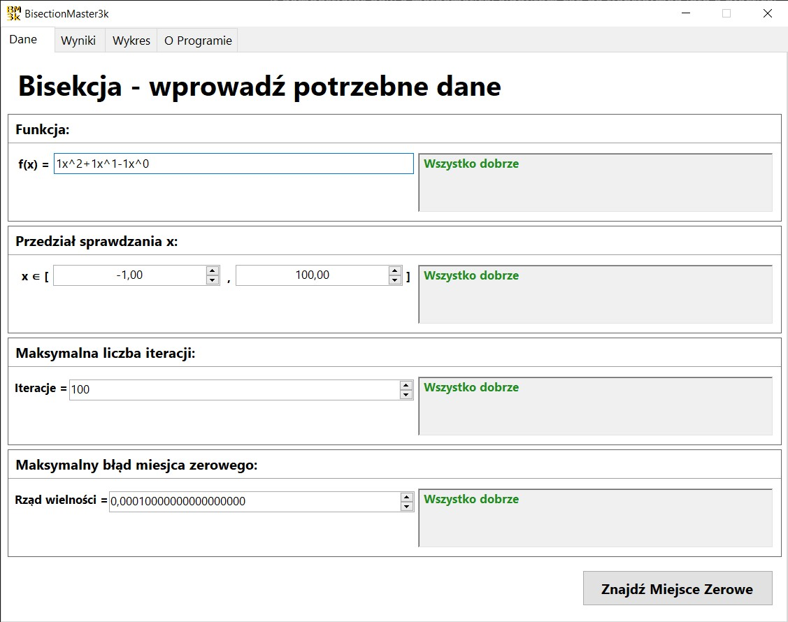
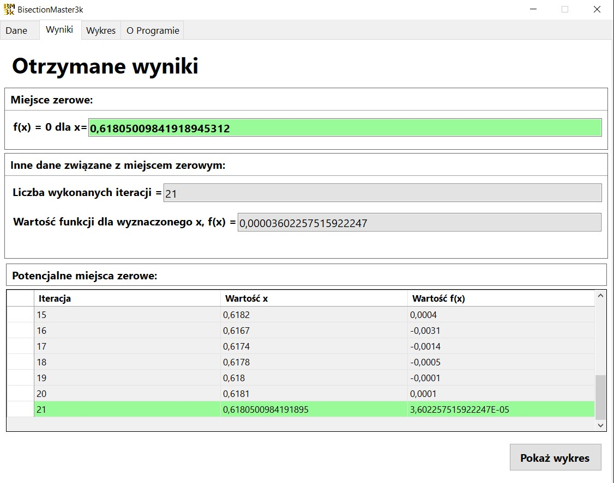
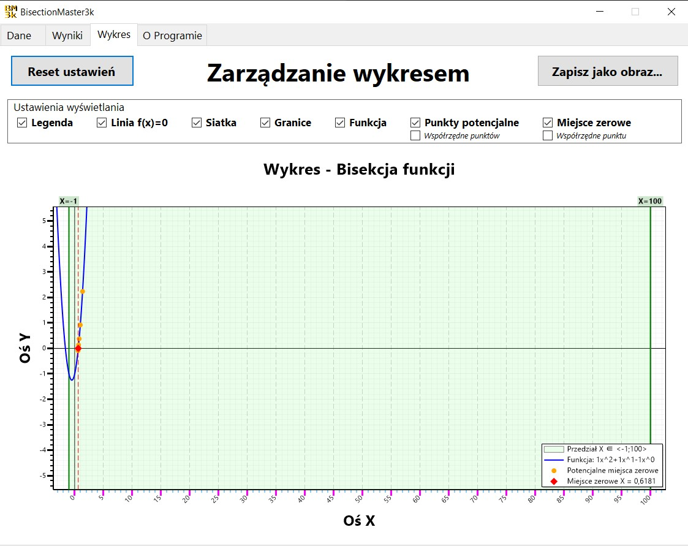

# BisectionMaster3k
Windows Forms app created for root-finding using Bisection Method

**BisectionMaster3k** to aplikacja desktopowa napisana z wykorzystaniem platformy .NET - **Windows Forms**, umożliwiająca wyznaczanie przybliżonych miejsc zerowych funkcji za pomocą **metody bisekcji**.

Projekt został wykonany w ramach studiów i łączy implementację algorytmu numerycznego z graficznym interfejsem użytkownika oraz wizualizacją analizowanej funkcji.

---

## Podgląd aplikacji

<p align="center">
  
</p>

---

## O projekcie

Celem projektu było praktyczne zastosowanie metody bisekcji oraz stworzenie aplikacji umożliwiającej wykonywanie obliczeń numerycznych za pomocą intuicyjnego interfejsu graficznego.

Projekt został wykonany w ramach studiów jako projekt akademicki.

Metoda bisekcji jest numeryczną metodą wyznaczania przybliżonych miejsc zerowych funkcji ciągłych.

Działanie metody polega na wielokrotnym dzieleniu zadanego przedziału na dwie części i wybieraniu tej części, w której znajduje się poszukiwane miejsce zerowe.

BisectionMaster3k pozwala przeprowadzić ten proces automatycznie, prezentując użytkownikowi zarówno **wynik obliczeń**, jak i kolejne etapy działania algorytmu przy pomocy interfejsu graficznego.


---

## Funkcje aplikacji

* wyznaczanie miejsc zerowych funkcji metodą bisekcji,
* definiowanie funkcji przez użytkownika,
* określanie przedziału poszukiwania,
* kontrola poprawności wprowadzonych danych,
* iteracyjne przybliżanie miejsca zerowego,
* prezentacja wyników obliczeń,
* prezentacja kolejnych iteracji algorytmu,
* wizualizacja analizowanej funkcji,
* graficzne przedstawienie otrzymanego rozwiązania,
* obsługa błędów i nieprawidłowych danych wejściowych.

---

# Działanie aplikacji

## 1. Wprowadzanie funkcji

Aplikacja udostępnia graficzny interfejs pozwalający skonfigurować obliczenia oraz uruchomić metodę bisekcji. 

W zakładce **Dane** użytkownik może określić funkcję, dla której ma zostać znalezione miejsce zerowe, oraz parametry wykorzystywane podczas obliczeń.

<p align="center">
  
</p>

---

## 2. Wynik obliczeń

Po wykonaniu obliczeń aplikacja prezentuje wyznaczone przybliżenie miejsca zerowego w zakładce **Wyniki** wraz z prezentacją kolejnych etapów działania algorytmu w tabeli iteracji. 

Dzięki temu można prześledzić, w jaki sposób kolejne iteracje powodują zmniejszanie przedziału poszukiwania.

<p align="center">
  
</p>

---

## 3. Wykres funkcji

Aplikacja umożliwia również graficzną prezentację analizowanej funkcji w zakładce **Wykres**.

Wykres pozwala łatwiej zobrazować położenie miejsca zerowego oraz sposób, w jaki metoda bisekcji zawęża obszar poszukiwania rozwiązania.

<p align="center">
  
</p>

---

## Technologie

- **.NET 6.0**,
- **Windows Forms**,
- **Visual Studio 2022**,
- **ScottPlot.WinForms 4.1.70** – tworzenie wykresów i wizualizacja wyników.

---

# Struktura

| Plik / katalog  | Opis                                 |
| --------------- | ------------------------------------ |
| `Bisection.cs`  | Implementacja metody bisekcji        |
| `Polynomial.cs` | Obsługa funkcji wielomianowych       |
| `Parser.cs`     | Przetwarzanie wprowadzanych wyrażeń  |
| `Validator.cs`  | Walidacja danych wejściowych         |
| `Exceptions.cs` | Obsługa wyjątków aplikacji           |
| `KGraph.cs`     | Funkcjonalności związane z wykresami |
| `Frontend/`     | Elementy interfejsu użytkownika      |
| `Datatypes/`    | Wykorzystywane typy danych           |
| `Graphics/`     | Elementy związane z grafiką          |

---

# Klonowanie repozytorium

```bash
git clone https://github.com/DominikBut/BisectionMaster3k.git
```

Następnie należy otworzyć w środowisku Visual Studio plik:

```text
BisectionMaster3k.sln
```
Po zbudowaniu rozwiązania aplikację można uruchomić standardowo.

---

# Autorzy

Projekt grupowy wykonany w ramach studiów:

- **Dominik But** [GitHub – DominikBut](https://github.com/DominikBut)
- **Kacper Malicki** [GitHub – Kacper Malicki](https://github.com/kacmal271)
- **Aleksander Klak** [GitHub – Aleksander Klak](https://github.com/HandsomeKarton)

---


